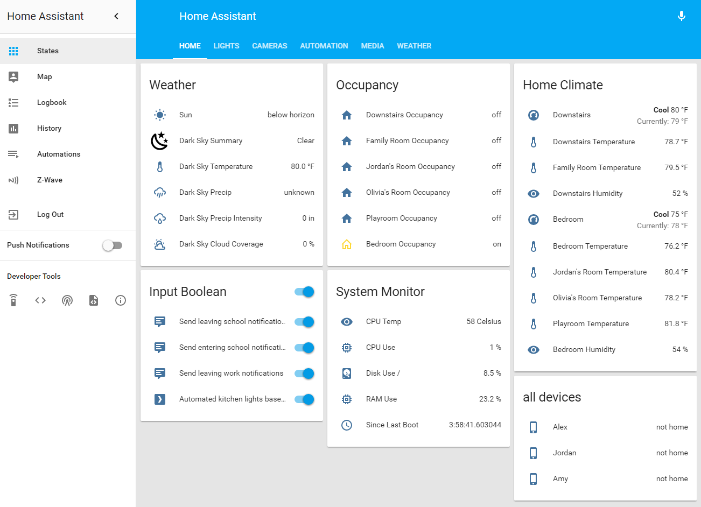

# Home Assistant Configuration

My [Home Assistant](https://home-assistant.io/) Configuration Files

## Ideas and Inspiration From:

- [Dale3h](https://github.com/dale3h/homeassistant-config) 
- [Bart274](https://github.com/Bart274/icloudplatform)

## Screenshot

## Current Devices
- [Plex Media Server](https://www.plex.tv/)
- [Amazon Echo](https://www.amazon.com/gp/product/B00X4WHP5E/ref=as_li_tl?ie=UTF8&camp=1789&creative=9325&creativeASIN=B00X4WHP5E&linkCode=as2&tag=tzonkov-20&linkId=3add3da278c91b57f14ee4b5aa941d97)
- GE Z-Wave Wireless Lighting Control On/Off Switch, [12722](https://www.amazon.com/gp/product/B0035YRCR2/ref=as_li_tl?ie=UTF8&camp=1789&creative=9325&creativeASIN=B0035YRCR2&linkCode=as2&tag=tzonkov-20&linkId=d9efe53d35604f066b32f9da809d1f28)
- GE Z-Wave Smart Dimmer, [12724](https://www.amazon.com/gp/product/B006LQFHN2/ref=as_li_tl?ie=UTF8&camp=1789&creative=9325&creativeASIN=B006LQFHN2&linkCode=as2&tag=tzonkov-20&linkId=4dbb2b7892e8abf6c15401de9a6c7ed4)
- Aeon Labs Aeotec Z-Wave Z-Stick, Gen5 [ZW090](https://www.amazon.com/gp/product/B00X0AWA6E/ref=as_li_tl?ie=UTF8&camp=1789&creative=9325&creativeASIN=B00X0AWA6E&linkCode=as2&tag=tzonkov-20&linkId=18633d8d0e7ed9c80804ae8b5699c941)

## Device Wishlist
- [Ecobee3](https://www.amazon.com/gp/product/B00ZIRV39M/ref=as_li_tl?ie=UTF8&camp=1789&creative=9325&creativeASIN=B00ZIRV39M&linkCode=as2&tag=tzonkov-20&linkId=092b7b794b3b6c099e94a5f6cfbb33af) Smart Thermostat
- Logitech Harmony [Elite All in One](https://www.amazon.com/gp/product/B014PDFP9S/ref=as_li_tl?ie=UTF8&camp=1789&creative=9325&creativeASIN=B014PDFP9S&linkCode=as2&tag=tzonkov-20&linkId=e3b94e1772f1a4ceb25430e963b57aba) Remote 

## Disclosure
Alex Tzonkov is a participant in the Amazon Services LLC Associates Program, an affiliate advertising program designed to provide a means for sites to earn advertising fees by advertising and linking to amazon.com.
